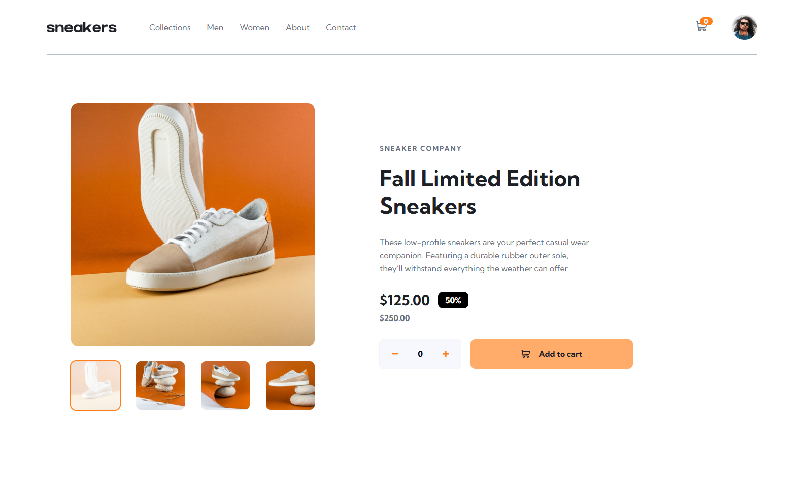

# Frontend Mentor - E-commerce Product Page Solution

This is my solution to the [E-commerce Product Page Challenge](https://www.frontendmentor.io/challenges/ecommerce-product-page-UPsZ9MJp6) on Frontend Mentor. The project focuses on building a responsive product page with an interactive image gallery and shopping cart functionality using HTML, CSS, and JavaScript.

---

## Overview

### The Challenge

Users should be able to:

- View the optimal layout for the site depending on their device's screen size
- See hover states for all interactive elements on the page
- Open a lightbox gallery by clicking on the large product image
- Switch the large product image by clicking on the small thumbnail images
- Add items to the cart
- View the cart and remove items from it

---

## Screenshot

---

## Links

- Solution URL: (https://leoidk21.github.io/E-commerce-product-page/)
- Live Site URL: (https://leoidk21.github.io/E-commerce-product-page/)

---

## Built With

- Semantic UI
- Responsive Design
- Vanilla JavaScript
- CSS Custom Properties & Flexbox layout

---

## Features

- Responsive navigation menu
- Product image gallery with thumbnails
- Lightbox image viewer
- Quantity selector
- Remove items from cart functionality

---

## What I Learned

While building this project, I improved my understanding of:

- DOM manipulation with JavaScript
- Event handling
- Dynamic element creation
- Managing application state for cart functionality
- Preventing duplicate cart items and updating quantities dynamically

---

## Author

- GitHub: https://github.com/leoidk21
- Frontend Mentor: https://www.frontendmentor.io/profile/leoidk21

